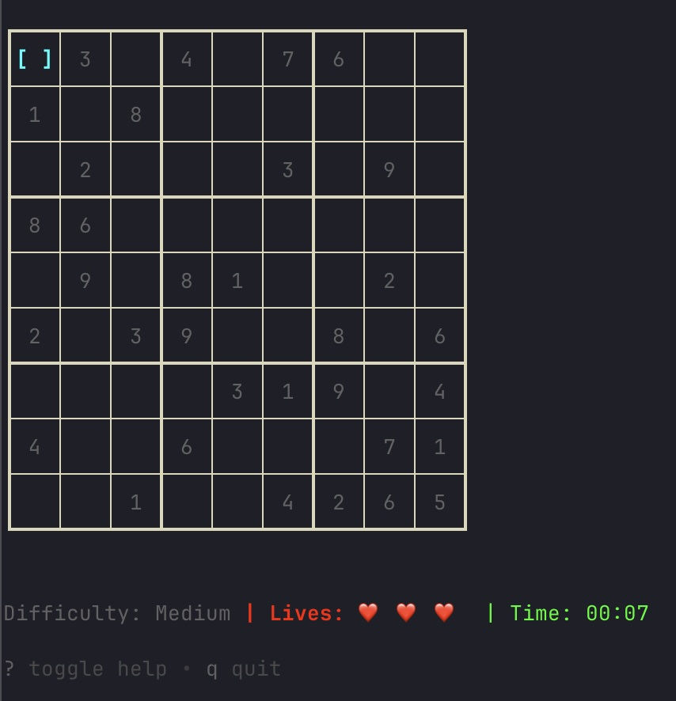

# Sudoku CLI

A terminal-based Sudoku game built with Go and Bubble Tea.



## Features

- Interactive menu system
- Terminal-based UI using Bubble Tea
- Keyboard navigation (arrow keys or vim-style j/k)

## Controls

- **Arrow Keys** or **j/k**: Navigate menu items
- **Enter** or **Space**: Select menu item
- **d**: Switch difficulty (game needs to be reloaded after switching)
- **q** or **Ctrl+C**: Quit application

## Installation

### Option 1: One-Line Install Script (Recommended)

**No Go installation required!** Run this command to automatically detect your system and install the appropriate binary:

```bash
curl -fsSL https://raw.githubusercontent.com/jensderond/sudoku-cli/master/install.sh | bash
```

### Option 2: Manual Download

Download the appropriate binary for your system from the [releases page](https://github.com/jensderond/sudoku-cli/releases):

#### Linux (64-bit)
```bash
wget https://github.com/jensderond/sudoku-cli/releases/latest/download/sudoku-linux-amd64.tar.gz
tar -xzf sudoku-linux-amd64.tar.gz
sudo mv sudoku /usr/local/bin/sudoku
```

#### Linux (ARM64)
```bash
wget https://github.com/jensderond/sudoku-cli/releases/latest/download/sudoku-linux-arm64.tar.gz
tar -xzf sudoku-linux-arm64.tar.gz
sudo mv sudoku /usr/local/bin/sudoku
```

#### macOS (Intel)
```bash
wget https://github.com/jensderond/sudoku-cli/releases/latest/download/sudoku-macos-amd64.tar.gz
tar -xzf sudoku-macos-amd64.tar.gz
sudo mv sudoku /usr/local/bin/sudoku
```

#### macOS (Apple Silicon)
```bash
wget https://github.com/jensderond/sudoku-cli/releases/latest/download/sudoku-macos-arm64.tar.gz
tar -xzf sudoku-macos-arm64.tar.gz
sudo mv sudoku /usr/local/bin/sudoku
```

#### Windows
1. Download `sudoku-windows-amd64.zip` from the [releases page](https://github.com/jensderond/sudoku-cli/releases)
2. Extract the zip file
3. Move `sudoku.exe` to a folder in your PATH or run it directly

### Option 3: Install with Go (for developers)

To install directly from GitHub:

```bash
go install github.com/jensderond/sudoku-cli/cmd/sudoku@latest
```

Or install a specific version:

```bash
go install github.com/jensderond/sudoku-cli/cmd/sudoku@v1.0.0
```

### Option 4: Build from Source

```bash
git clone https://github.com/jensderond/sudoku-cli.git
cd sudoku-cli
go build -o sudoku ./cmd/sudoku
```

## Development

To run the application in development mode:

```bash
go run ./cmd/sudoku
```

To build and install locally:

```bash
go build -o sudoku ./cmd/sudoku
mkdir -p ~/bin
cp sudoku ~/bin/sudoku
```

Then run the executable:

```bash
~/bin/sudoku
```

## Dependencies

- [Bubble Tea](https://github.com/charmbracelet/bubbletea) - A powerful little TUI framework

## Project Status

This is a Sudoku CLI application. The current implementation provides:

- Basic menu structure
- Keyboard navigation
- Interactive selection system
- Different difficulty levels

Future enhancements could include:
- Game statistics
- Save/load functionality
